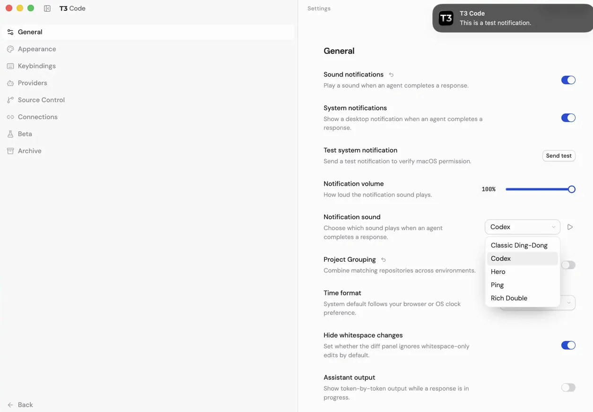
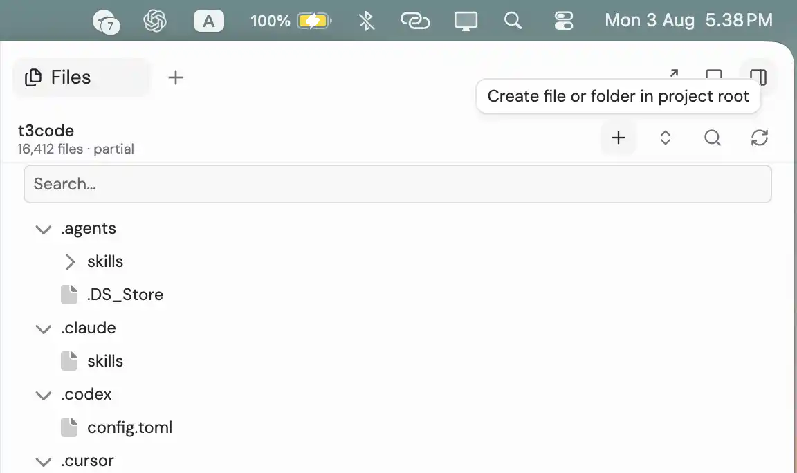

# T3 Code Custom

> 🍴 Fork of [pingdotgg/t3code](https://github.com/pingdotgg/t3code) by [Theo](https://github.com/pingdotgg) — with personal customizations.

T3 Code is an "agent harness control surface". It enables control of the agents on your machine with a best-in-class mobile app, [web app](https://app.t3.codes) and [Electron-based desktop app](https://t3.codes).

Works with your subscriptions on Claude Code, Codex, Cursor, Grok Build, and OpenCode — plus a fully agentic **DeepSeek** provider (custom fork addition). If they're set up on your computer, T3 Code can control them.

## Custom Features

This fork includes the following additions on top of upstream:

**Sound notifications**

- **Sound notifications** — audible chime when an agent turn completes
- **Volume control** — slider to adjust notification sound volume
- **Sound preset picker** — 5 presets (Codex, Hero, Ping, Classic Ding-Dong, Rich Double) with preview button

All sound customizations live in **Settings → Notifications**.

**Files panel**

- **Complete file browser** — the sidebar lists the real local workspace, including dotfiles and gitignored paths, with a partial indicator when the 25,000-entry cap is hit
- **File operations** — create files and folders at the project root or inside folders, rename inline, delete with confirmation, and move by drag-and-drop
- **Expand / collapse all** — one toggle expands or collapses every folder in the tree

**Desktop notifications**

- **Completion banner** — shows an OS notification with the agent's final output whenever a turn completes, focused or not
- **Custom sound** — the selected preset chime plays with the banner (macOS's default notification sound is suppressed), driven by the same completion trigger
- **Settings → General → System notifications** — enable toggle plus a **Send test** button to verify permission

**DeepSeek provider (agentic)**

- DeepSeek is a first-class provider tile: it keeps its full identity (icon, "API" badge, interaction mode toggle, `deepseek-v4-pro` / `deepseek-v4-flash` models, reasoning option) while running on the open-source **Codex CLI harness** as its engine.
- To use it, install the [Codex CLI](https://developers.openai.com/codex/cli) and point the provider at your DeepSeek Codex home (`~/.codex-deepseek`). `deepseek-v4-flash` works end-to-end and is the default; `deepseek-v4-pro` is still gated by DeepSeek's API (verified as of early August 2026) but stays selectable in the model list.
- Added via **Add provider → DeepSeek**, like any other provider.

## Screenshots

**Notification settings** — sound and system notification settings, with the test notification banner.



**Files panel** — complete file browser listing dotfiles and gitignored paths, with the partial indicator.



See [CUSTOM.md](./CUSTOM.md) for the full fork changelog, DeepSeek architecture notes, and upstream sync/confidentiality guidance.

## "Wait, what are you selling me?"

Nothing. We built T3 Code because we wanted the best possible development experience with agents. We were inspired by existing solutions like the Codex desktop app, Conductor, Claude Desktop and Cursor Glass, but none met our bar.

We wanted something performant, remote-ready, and truly open. If we ever go the wrong direction, we want you to have everything you need to fork and build the editor that you want.

## Installation

> [!WARNING]
> T3 Code currently supports Codex, Claude, Cursor, Grok Build and OpenCode. Install and authenticate at least one provider before use:
>
> - Codex: install [Codex CLI](https://developers.openai.com/codex/cli) and run `codex login`
> - Claude: install [Claude Code](https://claude.com/product/claude-code) and run `claude auth login`
> - Cursor: install [Cursor CLI](https://cursor.com/cli) and run `cursor-agent login`
> - Grok Build: install [Grok Build CLI](https://x.ai/cli) and run `grok login`
> - OpenCode: install [OpenCode](https://opencode.ai) and run `opencode auth login`
> - DeepSeek (custom): install [Codex CLI](https://developers.openai.com/codex/cli) and add the provider via **Add provider → DeepSeek** (engine runs on the Codex harness against `~/.codex-deepseek`)

### Try it out (install-free)

The easiest way to test T3 Code is to run the server in your terminal:

```bash
npx t3@latest
```

This will launch T3 Code's backend on your machine as well as the local web app to control your agents.

Tip: Use `npx t3@latest --help` for the full CLI reference.

### Desktop app

Install the latest version of the desktop app from [GitHub Releases](https://github.com/pingdotgg/t3code/releases), or from your favorite package registry:

#### Windows (`winget`)

```bash
winget install T3Tools.T3Code
```

#### macOS (Homebrew)

```bash
brew install --cask t3-code
```

#### Arch Linux (AUR)

```bash
yay -S t3code-bin
```

## Some notes

We are very very early in this project. Expect bugs.

We are (mostly) not accepting contributions yet. Small fixes may be considered. Big features will not be.

There's no public docs site yet, checkout the miscellaneous markdown files in [docs](./docs).

## Documentation

- [Getting started](./docs/getting-started/quick-start.md)
- [Remote access](./docs/user/remote-access.md)
- [Keeping T3 Code in sync](./docs/user/server-updates.md)
- [Architecture overview](./docs/architecture/overview.md)
- [Provider guides](./docs/providers/codex.md)
- [Operations](./docs/operations/ci.md)
- [Reference](./docs/reference/encyclopedia.md)

## If you REALLY want to contribute still.... read this first

### Install `vp`

T3 Code uses Vite+ so you'll need to install the global `vp` command-line tool.

#### macOS / Linux

```bash
curl -fsSL https://vite.plus | bash
```

#### Windows

```bash
irm https://vite.plus/ps1 | iex
```

Checkout their getting started guide for more information: https://viteplus.dev/guide/

### Install dependencies

```bash
vp i
```

Read [CONTRIBUTING.md](./CONTRIBUTING.md) before opening an issue or PR.

Need support? Join the [Discord](https://discord.gg/jn4EGJjrvv).
